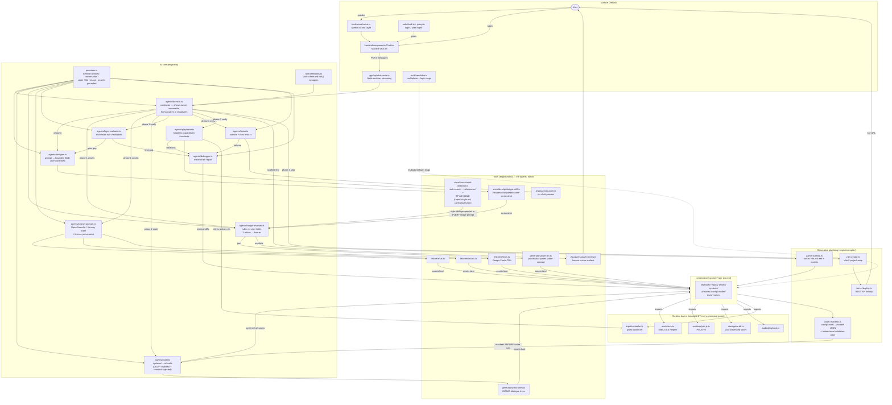

# Engine Architecture — Module Interaction Map

> How every module in this repo wires together to produce a game under `generations/<game>/`
> (layout per `generations/info.md`). Agents are LangChain v1 `createAgent` instances; the
> director composes the rest as tools/subagents. Each chat turn advances one pipeline phase
> (Vercel 300s limit), resumable via LangGraph checkpointer.

## Reading the loops

1. **Asset quality loop:** image-gen/pixel-art → image-reviewer (rubric vs style bible) → ≤3 retries → asset-review.ts human gate.
2. **Logic loop:** GDD → logic-evaluator (truth tables) → spec gaps back to designer *before* coding; impl gaps to debugger *after*.
3. **Code quality loop:** coder → tester (tests.ts via test-runner) + playtester (controller-driven invariants + prototype-still vision check) → debugger (minimal diffs) → re-verify.
4. **Human gates:** GDD confirmation (designer), asset escalation (asset-review), deploy approval (director) — all surfaced in the chat.

## Invariants this wiring depends on

- Style bible exists before any image generation (visual-direction is phase 0/1 output).
- `config/` manifest exists before coder runs; validation pass is plain code, not an agent.
- Every fetched asset has `LICENSE.json` provenance (GPL-3.0 compatibility).
- Each chat turn = one director phase; state resumes from checkpointer + the game folder itself.
