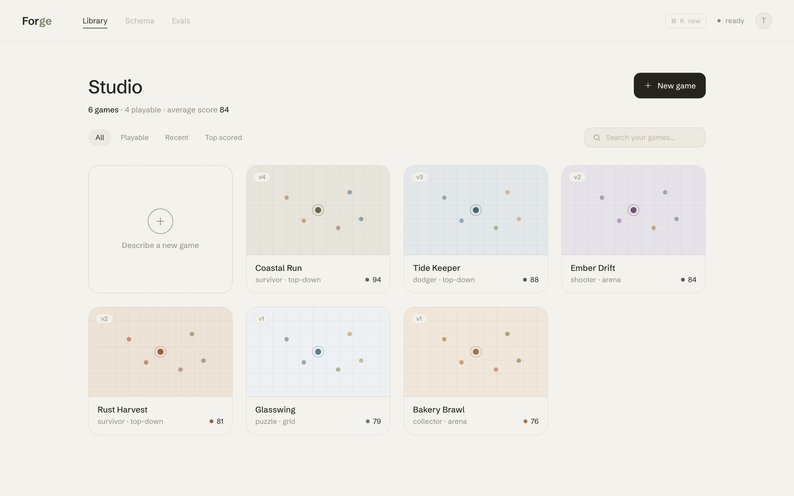
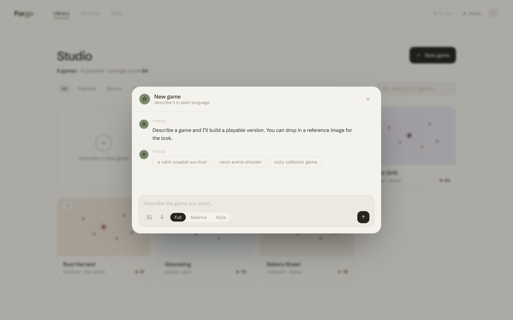
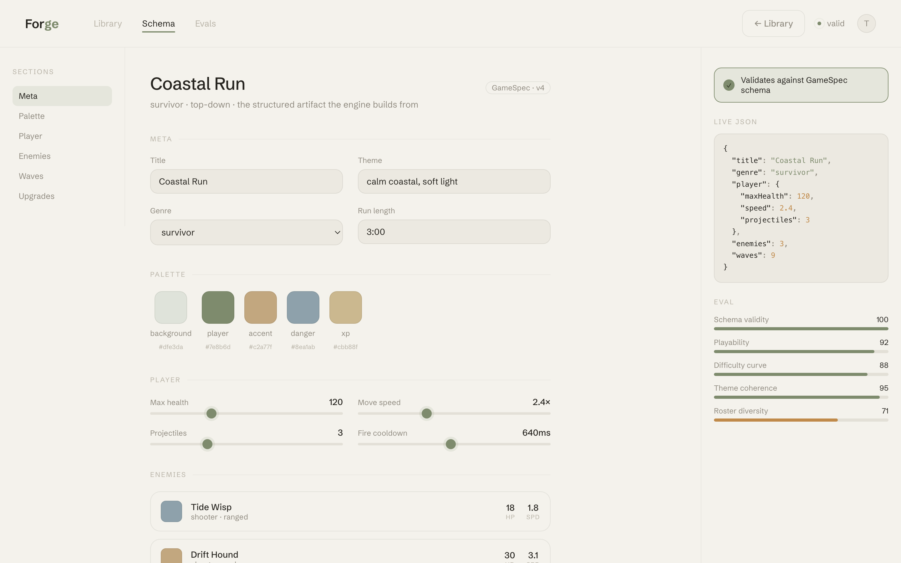
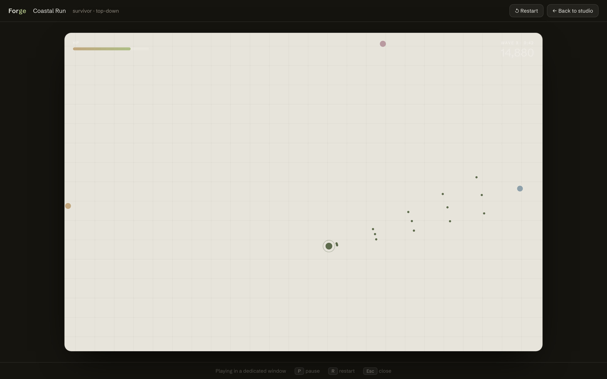

# Forge — Frontend Spec

> Read this first if you're an AI agent or developer picking up the Forge frontend on a
> fresh machine. It explains **what we're building, how the UI is structured, the design
> system, and exactly where real backend/engine code plugs in.** Everything in `design/`
> is a working, framework-agnostic prototype (plain HTML/CSS/JS, no build step) that
> defines the visual + interaction bar. Open any `.html` file in a browser to see it live.

---

## 1. Product

**Forge** is the frontend for `ai-native-gameengine` (repo: `LaymanTeam/ai-native-gameengine`).

The product: **describe a game in plain language (or voice) → an AI generates a structured
`GameSpec` → a fixed engine renders it into a playable game.** Users keep refining in
conversation ("make enemies slower, add fog"), and every build is scored and saved.

Pipeline the UI visualizes: `prompt → spec → patch → build → QA → (repair) → playable`.

The AI only produces **bounded, structured data** (the `GameSpec`), never arbitrary code —
the engine runtime is authored and fixed. This repo owns the **schema** (the source of
truth for what a game *is*); sibling repos provide engine runtimes.

### Who does what
- **This person owns the frontend** (the UI in `design/`).
- A teammate pushes backend/schema/engine code (lands later — wire it into the seams in §6).

---

## 2. The three surfaces

Forge is a coherent 3-surface app, all sharing one design system (`forge.css`) and linked
via the top nav (Library · Schema · Evals).

| Surface | File | Role |
|---|---|---|
| **Library** | `dashboard.html` | Manage your games. Grid of generated games; create/refine via a chat **dialog**. |
| **Schema** | `schema.html` | Inspect/edit the `GameSpec` — the structured artifact the engine builds from. |
| **Play** | `game.html` | The game runs in its **own popped-out window**, separate from the studio. |

Mental model: **Library = manage · Dialog = create/refine · Game window = play.**

### 2.1 Library — `dashboard.html`


- Grid of game cards; each thumbnail is a tiny live survivor sim that **animates on hover**
  (starts on `mouseenter`, freezes to a static frame on `mouseleave` — see `MiniSim` class).
- Header with **New game** button; quiet stat line; **filters** (All/Playable/Recent/Top)
  and **search**.
- **⌘K** (or the New game button, or the dashed "new" card) opens the create dialog.
- Card actions on hover: **Play** (opens game window) / **Refine** (opens dialog with that
  game's context). Toasts confirm actions.

### 2.2 The chat dialog (lives in `dashboard.html`)


- Spring-animated modal over a dimmed scrim (Esc / click-outside closes; focus is restored).
- Conversation: Forge messages **stream in** (typewriter + caret); user messages are bubbles.
- An animated **build trace** steps through spec → patch → build → qa, then resolves to a
  **"ready to play"** card with **Open game ↗**.
- Composer: auto-growing textarea, **image-reference** button (multimodal visual direction),
  **voice** button, and an inline **Full / Balance / Style** mode switch.
- Deep link: `dashboard.html?new` auto-opens the dialog on load.

### 2.3 Schema — `schema.html`


- The `GameSpec` as a calm editor: meta fields, **live color pickers** (palette), **sliders**
  with live values (player/wave stats), enemy cards, upgrades, and a rendered **waves
  timeline** with a boss marker.
- Left **section nav** highlights as you scroll (IntersectionObserver) and smooth-scrolls.
- Right rail: **live JSON**, a **"validates against GameSpec"** badge, and **eval bars**
  (schema validity, playability, difficulty curve, theme coherence, roster diversity).

### 2.4 Play — `game.html`


- Opened via `window.open()` from Library/dialog into a dedicated, centered popup.
- Actually playable placeholder sim: **WASD / arrows** move, auto-fire, enemies chase,
  score climbs. **P** pause, **R** restart, **Esc** close.
- Reads palette/title/genre from URL query params, so each game looks distinct.

---

## 3. Design system — `forge.css`

The single stylesheet every page imports. It is the "world-class" foundation: change a
token here and the whole app updates. **Maps 1:1 to a Tailwind theme / React CSS vars.**

- **Surfaces:** `--paper`, `--paper-2/3`, `--canvas`
- **Ink:** `--ink`, `--muted`, `--faint`
- **Accent + semantic:** `--accent`, `--accent-soft`, `--accent-ink`, `--warn`
- **Lines/glass:** `--line`, `--line-2`, `--oc` (on-canvas rgb triplet), `--glass`, `--glass-line`
- **Type scale:** `--fs-display/h1/h2/body/sm/xs/cap` (font = **Schibsted Grotesk**)
- **Space:** `--sp-1..14` (4px base) · **Radius:** `--r-sm..2xl/full` · **Shadow:** `--sh-1/2/3/pop`
- **Motion:** `--ease`, `--ease-spring`, `--t-fast/t/t-slow`

### Aesthetic direction (settled through iteration)
- **Scandinavian / Nordic:** warm "bone" paper, generous whitespace, low cognitive load.
- **One restrained accent** (default muted **sage** `#7e8b6d`). Never neon, never busy.
- **Schibsted Grotesk** only (rejected: Instrument Serif, dense neon dashboards).
- Calm even in the game preview — the placeholder sim uses the same muted palette.

### Theming
Set `data-theme` on `<html>`. Built in: `bone` (default), `mist` (cool slate-blue),
`clay` (warm terracotta), `night` (dark). Adding a theme = one `[data-theme="x"] { … }` block.

### Built-in quality
Focus-visible rings, `prefers-reduced-motion` support, ARIA on the dialog, full keyboard
paths, custom scrollbars, reusable components (`.btn`, `.chip`, `.seg`, `.pill`, `.toast`,
`.topbar`, `.nav`, entrance `.rise`).

---

## 4. File map (`design/`)

```
forge.css            # design system — tokens, base, components, themes  (import everywhere)
dashboard.html       # Library + chat dialog  ← primary surface, START HERE
schema.html          # GameSpec inspector/editor
game.html            # standalone playable popout window
screenshots/         # rendered PNGs used in this doc
FRONTEND_SPEC.md     # this file

# Earlier explorations (superseded, kept for reference — safe to ignore/delete):
studio-themes.html  studio-nordic-chat2.html  studio-nordic-chat.html
studio-nordic.html  studio-elegant.html       studio-mockup.html
```

---

## 5. Run / preview

No build step. Either:
- Open `design/dashboard.html` directly in a browser, **or**
- Serve the folder (needed for clean relative paths & popups):
  ```bash
  cd design && python3 -m http.server 8765
  # then open http://localhost:8765/dashboard.html
  ```

Regenerate screenshots (headless Chrome, macOS):
```bash
cd design && python3 -m http.server 8765 &
CHROME="/Applications/Google Chrome.app/Contents/MacOS/Google Chrome"
"$CHROME" --headless=new --hide-scrollbars --force-device-scale-factor=2 \
  --window-size=1440,900 --virtual-time-budget=3500 \
  --screenshot=screenshots/dashboard.png http://localhost:8765/dashboard.html
# repeat for dashboard.html?new , schema.html , game.html?...
```

---

## 6. Integration seams — where real code plugs in

Everything is presentational today. When backend/engine code lands, wire it here:

| Seam | File · symbol | Replace with |
|---|---|---|
| **Generate / refine** | `dashboard.html` → `build()`, `ready()` | POST prompt+mode+locks to the generate endpoint; stream the response; on completion append the artifact/ready card. |
| **Streaming chat** | `dashboard.html` → `forgeStream()` | Real token stream from the model (keep the caret UX). |
| **Game thumbnails** | `dashboard.html` → `class MiniSim` | Swap placeholder sim for a thumbnail/snapshot of the real engine, or keep as lightweight preview. |
| **Playable game** | `game.html` (whole) | Embed the real engine runtime; feed it the actual `GameSpec` (currently palette via URL params). |
| **Schema editor** | `schema.html` fields | Bind inputs to the real **Zod `GameSpec`**; round-trip JSON; live-validate. |
| **Library data** | `dashboard.html` → `GAMES[]` | Fetch from the content store (event-sourced; provenance/versions). |
| **Eval scores** | `schema.html` eval bars, card scores | Real scorer output (schema validity, playability, llm-as-judge, etc.). |
| **Design tokens** | `forge.css` `:root` | Become the Tailwind theme / CSS-var source for the React port. |

### Expected GameSpec shape (what the UI assumes)
The UI is built around a structured spec roughly like:
```jsonc
{
  "title": "Coastal Run",
  "genre": "survivor",            // survivor | dodger | shooter | collector | puzzle
  "theme": "calm coastal, soft light",
  "palette": { "background": "#…", "player": "#…", "accent": "#…", "danger": "#…", "xp": "#…" },
  "player":  { "maxHealth": 120, "speed": 2.4, "projectiles": 3, "cooldownMs": 640 },
  "enemies": [ { "name": "Tide Wisp", "role": "shooter", "color": "#…", "health": 18, "speed": 1.8 } ],
  "bosses":  [ { "name": "Harbor Maw", "spawnAtSeconds": 90, "health": 900 } ],
  "waves":   [ { "atSeconds": 10, "enemy": "…", "count": 8, "everyMs": 600 } ],
  "upgrades":[ "damage", "cooldown", "speed", "maxHealth", "projectiles", "magnet" ]
}
```
> This mirrors the prototype game specs in the sibling repos. Treat the real Zod schema in
> this repo as authoritative once it lands; update `schema.html` field groupings to match.

---

## 7. Porting to React (when ready)

The prototype is intentionally framework-agnostic. Suggested mapping:
- `forge.css` tokens → Tailwind `theme.extend` (colors, spacing, radius, fontFamily) or a
  `globals.css` `:root` (keep the var names).
- Surfaces → routes/pages: `/` (Library), `/schema/[id]`, `/play/[id]` (or a popup route).
- Components: `<TopBar>`, `<GameCard>` (+ `MiniSim` as a hook/canvas component),
  `<CreateDialog>` (+ `<ChatThread>`, `<BuildTrace>`, `<Composer>`), `<SpecEditor>`,
  `<EvalBars>`, `<Toasts>`.
- Keep the interaction details (hover-to-animate, streaming caret, spring dialog, scroll-spy
  section nav, ⌘K) — they're what make it feel finished.

---

## 8. Status & next steps

**Done:** full design system; Library with live cards + dialog; Schema editor; Play window;
screenshots; 4 themes.

**Open / next:**
- [ ] Evals surface (`evals.html`) — currently a nav stub.
- [ ] Reference-image attachment UI (thumbnails in composer + in messages).
- [ ] Wire real generation/engine/schema (see §6).
- [ ] Decide final default theme (bone/mist/clay/night).
- [ ] React/Tailwind port once backend stack is fixed.
