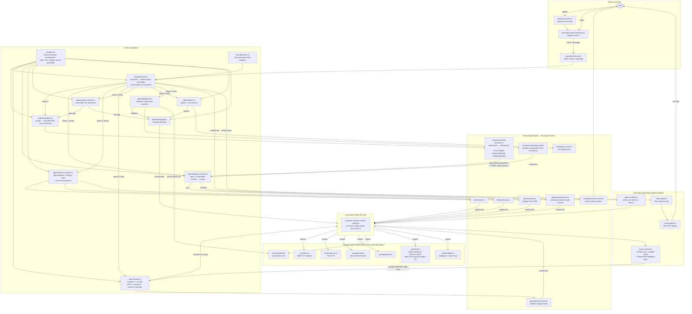

# Engine Architecture — Module Interaction Map

> How every module in this repo wires together to produce a game under `generations/<game>/`
> (layout per `generations/info.md`). Agents are LangChain v1 `createAgent` instances; the
> director composes the rest as tools/subagents. Each chat turn advances one pipeline phase
> (Vercel 300s limit), resumable via LangGraph checkpointer.



## Engine filetree (current, on disk)

```
ai-native-gameengine/
├── app/                                  # Next.js 16 App Router shell (the engine's surface)
│   ├── api/chat/route.ts                 #   SSE streaming route → director agent (Node runtime)
│   ├── layout.tsx                        #   Mantine provider (NO Clerk — engine UI is open)
│   └── page.tsx                          #   chat page
├── engine/
│   ├── ai/
│   │   ├── providers.ts                  # Gemini factories: conversation/coder/lite/image(+Pro)/
│   │   │                                 #   search-grounded/embeddings + generateImage()
│   │   ├── tool-definitions.ts           # Zod-schemaed LangChain tool() wrappers (per-request, emits events)
│   │   └── agents/                       # createAgent-based roster (+ co-located *.test.ts)
│   │       ├── director.ts               #   conductor — phase-aware, resumable (checkpointer/threadId)
│   │       ├── designer.ts               #   prompt → bounded GDD, user-confirmed
│   │       ├── planner-interpreter.ts    #   (user-added) plan parsing/interpretation
│   │       ├── researcher.ts             #   (user-added) game research → research/ + reports/
│   │       ├── coder.ts                  #   systems/ + ui/ code (GDD + manifest + research injected)
│   │       ├── image-reviewer.ts         #   rubric vs style bible, ≤3 retries → human
│   │       ├── search-and-get.ts         #   OpenGameArt/Kenney trawl + license provenance
│   │       ├── logic-evaluator.ts        #   truth-table rule verification
│   │       ├── playtester.ts             #   headless input-driven invariants
│   │       ├── tester.ts                 #   authors + runs tests.ts
│   │       └── debugger.ts               #   minimal-diff repair
│   ├── audio/playback.ts                 # Web Audio sfx/music layer (+ .test.ts)
│   ├── auth/
│   │   ├── clerk.ts                      # MULTIPLAYER player identity for generated games — never gates engine
│   │   └── sendblue.ts                   # iMessage/SMS multiplayer + login channel (+ .test.ts)
│   ├── compiler/
│   │   ├── game-scaffold.ts              # writes the info.md tree + main.ts skeleton
│   │   ├── asset-manifest.ts             # config/ asset↔variable JSON + bidirectional validation
│   │   ├── vite-creator.ts               # Vite 8 project wrap
│   │   └── vercel-deploy.ts              # programmatic REST deploy (each + .test.ts)
│   ├── ecs/bitecs.ts                     # bitECS 0.4 helpers (+ .test.ts)
│   ├── frontend/
│   │   ├── api/chat.ts                   # route logic shared with app/api/chat
│   │   └── components/
│   │       ├── Chat.tsx                  # SSE consumer: tokens, tool badges, inline images
│   │       └── utilities/index.ts        # CLI→chat evolution note + shared helpers
│   ├── input/controller.ts               # typed action set: keyboard/touch/gamepad (+ .test.ts)
│   ├── renderer/pixi-js.ts               # PixiJS v8 app/scene/sprite helpers (+ .test.ts)
│   ├── storage/rx-db.ts                  # Zod-schemaed RxDB save/state methods (+ .test.ts)
│   ├── testing/test-runner.ts            # runs a game's tests.ts via tsx child process (+ .test.ts)
│   └── tools/
│       ├── fetchers/                     # sfx.ts, music.ts (OpenGameArt/Kenney + license policy),
│       │                                 #   fonts.ts (Google Fonts CDN) (+ fetchers.test.ts)
│       ├── generators/                   # pixel-art.ts (procedural sprites), text-trees.ts (JSONIC
│       │                                 #   dialogue) (+ generators.test.ts)
│       ├── visualizers/                  # visual-direction.ts (style bible), prototype-still.ts,
│       │                                 #   asset-review.ts (human gate)
│       └── voice/voice.ts                # speech-to-text layer
├── generations/                          # generated games land here (info.md = layout spec)
│   └── info.md
└── research/                             # verified API references + this architecture doc
```

## Example generated game (expected output per `generations/info.md`)

```
generations/harbor-light/                 # game name = head folder
├── research/                             # researcher agent: genre/mechanic notes
├── references/                           # visual-direction: reference images of similar games
│   ├── ref-01-stardew-dock.png
│   └── ref-02-palette-dusk.png
├── reports/                              # structure rules etc.
│   ├── gdd.md                            #   bounded design doc (designer agent, user-confirmed)
│   ├── style.md                          #   STYLE BIBLE — palette/resolution/perspective/outline
│   └── logic-eval.md                     #   logic-evaluator truth-table results
├── assets/                               # every asset JSON-mapped to a code variable (see config/)
│   ├── sprites/                          #   gemini image gen OR pixel-art.ts procedural
│   │   ├── player-idle.png
│   │   ├── player-walk.png
│   │   └── fish-trout.png
│   ├── background/parallax-harbor.png
│   ├── images/title-card.png
│   ├── scenes/dock-night.png
│   ├── sfx/                              #   fetched via fetchers/sfx.ts
│   │   ├── splash.ogg
│   │   ├── reel.ogg
│   │   └── LICENSE.json                  #   provenance — required for every fetched folder
│   ├── music/
│   │   ├── theme-dusk.ogg
│   │   └── LICENSE.json
│   ├── fonts/                            #   Google Fonts CDN downloads
│   │   ├── pixelify-sans.woff2
│   │   └── LICENSE.json
│   └── text/                             #   JSONIC trees (generators/text-trees.ts)
│       └── dialogue-harbormaster.json
├── systems/                              # coder agent (research/ + gdd injected), on bitECS
│   ├── rules/day-night.ts                #   global logic
│   ├── animations/sprite-frames.ts
│   ├── entities/player.ts                #   individual asset logic
│   ├── entities/fish.ts
│   ├── ai/fish-behavior.ts               #   entity/ui behavior logic
│   ├── calls/save-sync.ts
│   ├── physics/buoyancy.ts
│   └── controller/bindings.ts            #   maps engine/input actions → game intents
├── ui/                                   # IN-GAME UI, Mantine (user ruling)
│   ├── components/Hud.tsx
│   ├── components/PauseMenu.tsx
│   └── methods/use-inventory.ts
├── saves/                                # state
│   ├── storage-schema.ts                 #   Zod schema for the save document
│   └── rx-db.ts                          #   game-local RxDB wiring (engine/storage helpers)
├── config/                               # JSON per asset tied to the variable used in code
│   ├── assets.json                       #   manifest: file ↔ variable (asset-manifest.ts, validated)
│   ├── style.json                        #   machine-readable style bible
│   └── gdd.json                          #   machine-readable design doc
├── render/
│   └── stage.ts                          #   PixiJS v8 scene assembly (engine/renderer helpers)
├── tests/
│   └── tests.ts                          #   self-authored tests (tester agent → test-runner)
└── main.ts                               # entry: init ECS world, load manifest, start render loop
```

## Reading the loops

1. **Asset quality loop:** image-gen/pixel-art → image-reviewer (rubric vs style bible) → ≤3 retries → asset-review.ts human gate.
2. **Logic loop:** GDD → logic-evaluator (truth tables) → spec gaps back to designer *before* coding; impl gaps to debugger *after*.
3. **Code quality loop:** coder → tester (tests.ts via test-runner) + playtester (controller-driven invariants + prototype-still vision check) → debugger (minimal diffs) → re-verify.
4. **Human gates:** GDD confirmation (designer), asset escalation (asset-review), deploy approval (director) — all surfaced in the chat.

## Invariants this wiring depends on

- Style bible exists before any image generation (visual-direction is phase 0/1 output).
- `config/` manifest exists before coder runs; validation pass is plain code, not an agent.
- Every fetched asset has `LICENSE.json` provenance (GPL-3.0 compatibility).
- Each chat turn = one director phase; state resumes from checkpointer + the game folder itself.
- **Clerk does NOT gate the engine app.** The engine chat UI is open. Clerk (and Sendblue) are runtime layers generated games import for MULTIPLAYER player identity/login. Never add Clerk middleware/providers to the engine's `app/` shell.

## Design Philosophy and Decisions

* **LangChain workflow and chaining agents** — orchestration lives IN LangChain, never a custom state machine: every agent is a v1 `createAgent` (LangGraph loop), e.g. `engine/ai/agents/director.ts` (module-scoped `MemorySaver` checkpointer keyed by `threadId`) composing the roster as tools via the per-request factory in `engine/ai/tool-definitions.ts`. Deterministic work stays plain code the model merely *invokes* — `applyMinimalDiff` in `debugger.ts`, `runPlaytest` in `playtester.ts` — so verdicts are produced by code, not vibes.
* **Vetted domain fallbacks for intelligence and accuracy (game theory & mechanics)** — agents don't freestyle their domain knowledge; the researcher/designer/coder ground against curated sources, mirroring how `research/*.md` grounds the engine's own code:
  * gamemechanicsexplorer.com — mechanic patterns for `designer.ts` GDDs and `logic-evaluator.ts` propositions
  * gameprogrammingpatterns.com — architecture idioms injected into `coder.ts` context
  * OpenGameArt — `tools/fetchers/sfx.ts`/`music.ts` build advanced-search URLs (`buildOpenGameArtSearchUrl`, art-type tids 13/12) and parse detail pages for license-cleared candidates
  * Kenney — CC0 fallback source in the same fetchers (`source: 'kenney'` in `AssetCandidateSchema`)
* **Voice interaction — increases accessibility** — `engine/tools/voice/voice.ts` layers OS speech-to-text over the same chat surface; the Mantine UI carries `aria-label`s/tooltips throughout (`Chat.tsx`) so the whole loop is reachable by ear and keyboard.
* **Vite portability, Next routes, and Vercel porting — users up and running fast** — the engine runs as Next.js 16 App Router (`app/api/chat/route.ts`, Node runtime, SSE) while each generated game is wrapped as an independent Vite 8 project (`compiler/vite-creator.ts`) and shipped via the Vercel REST API (`compiler/vercel-deploy.ts`) — prompt to live URL without leaving chat.
* **RxDB, Clerk, pixel-generator methods** — reusable runtime layers every game imports rather than regenerates: Zod-schemaed save/state methods (`storage/rx-db.ts`), multiplayer player identity (`auth/clerk.ts` — never gating the engine UI), and procedural sprites (`tools/generators/pixel-art.ts`, mask→sprite algorithm on node-canvas).
* **Gemini omni file creation — images, pixels, music, and SFX** — one provider surface (`engine/ai/providers.ts`) covers every modality: Nano Banana image gen (`generateImage()`, `responseModalities: ['TEXT','IMAGE']`), search-grounded research (`createSearchGroundedModel` binding the native `googleSearch` tool), code (`createCoderModel`), triage (`createTriageModel`), and embeddings — model IDs centralized so swaps are one-line.
* **ECS + Zod methods as a light declarative logic gate** — bitECS 0.4 helpers (`ecs/bitecs.ts`) keep game state queryable data; Zod schemas gate every boundary (`SessionStateSchema` in clerk.ts, `AssetCandidateSchema`/`LicenseRecordSchema` in the fetchers, `PlaytestReportSchema`, `StructuredFailureSchema`) so agents exchange validated structures, never loose JSON.
* **JSONIC query game-development memory — human-editable without an editor** — the `config/` manifests (`compiler/asset-manifest.ts`: asset↔variable bindings, `style.json`, `gdd.json`) and `assets/text/` dialogue trees (`tools/generators/text-trees.ts`) mean a human can retheme, rebind, or rewrite content with a text editor; the bidirectional validation pass catches anything they break.
* **CSS-driven Mantine UI elements — light and human-editable** — both the engine chat (`frontend/components/Chat.tsx`) and the generated games' in-game `ui/` use Mantine v9 with styling overridable via plain CSS rules, no build-step theming required.
* **Intra-AI generation — entities can make AI calls themselves** — because games ship with the same provider surface (`providers.ts` factories + `systems/calls/` in the game tree), generated entities can call Gemini at *play* time for dialogue, sounds, or images inside their own interfaces — the engine's generation loop continues inside the artifact it produced.

### Future

* **Tauri / Electron packaging for local play** — the Vite project shape (`vite-creator.ts`) is the deliberate enabler: a web-bundled game drops into a Tauri/Electron shell without restructure.
* **Rivet & Clerk & Sendblue web multiplayer** — `auth/clerk.ts` (player identity, `getSessionState`/`requireAuthInRouteHandler`) + `auth/sendblue.ts` (iMessage/SMS channel) are already runtime layers of every game; Rivet adds the netcode tier.
* **Vercel deploy → App Store & Play Store** — extend `compiler/vercel-deploy.ts` output through PWA/TWA wrapping.
* **Intra-game AI generation of entities — self-expanding games** — entities generating entities via the same intra-AI calls, persisted to localstorage/RxDB (`storage/rx-db.ts`), letting a shipped game grow content the engine never authored.

### Ultra-future

* **three.js / react-three-fiber — 3D** — scalars, texture mapping, complex collision; would slot in as a sibling of `renderer/pixi-js.ts` behind the same manifest/ECS contracts so the pipeline above is renderer-agnostic.
